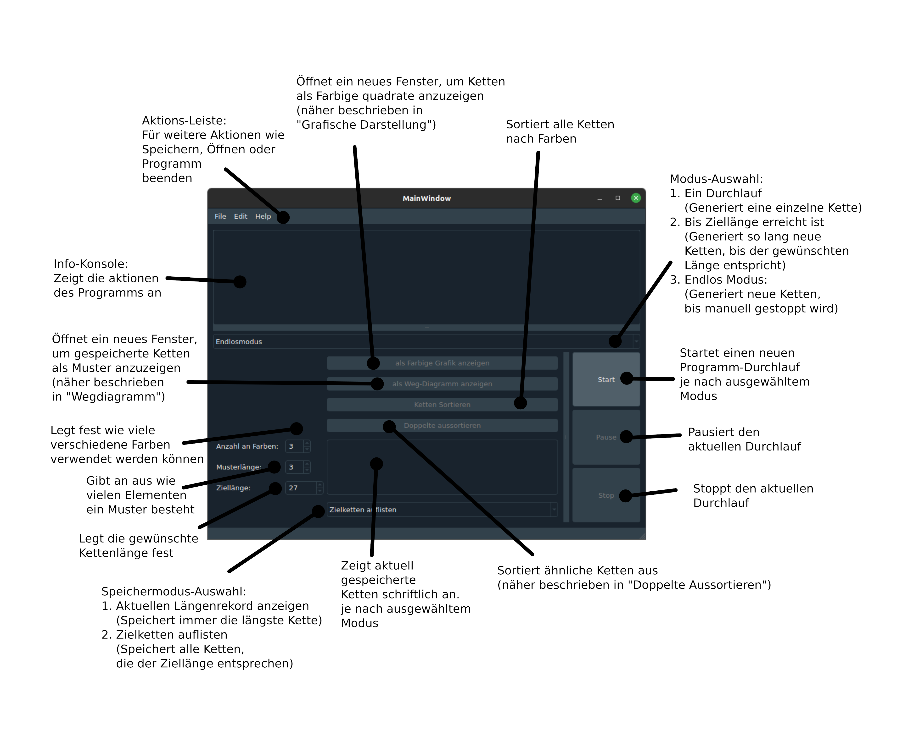
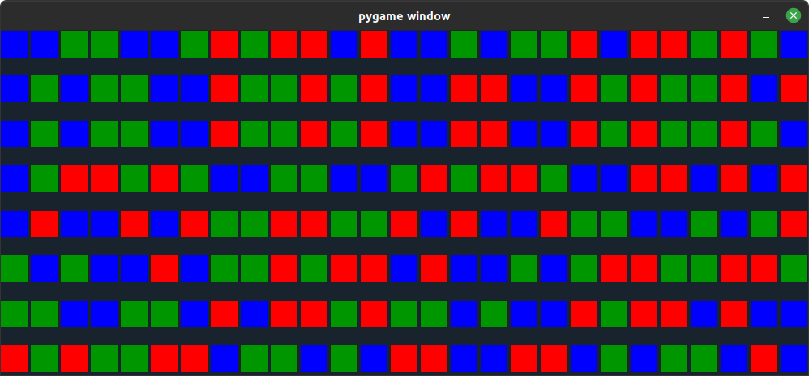
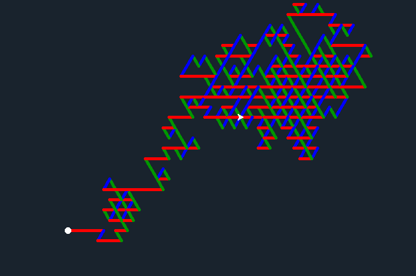
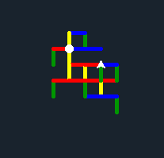
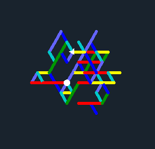
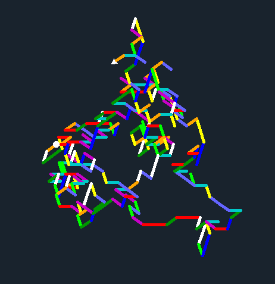
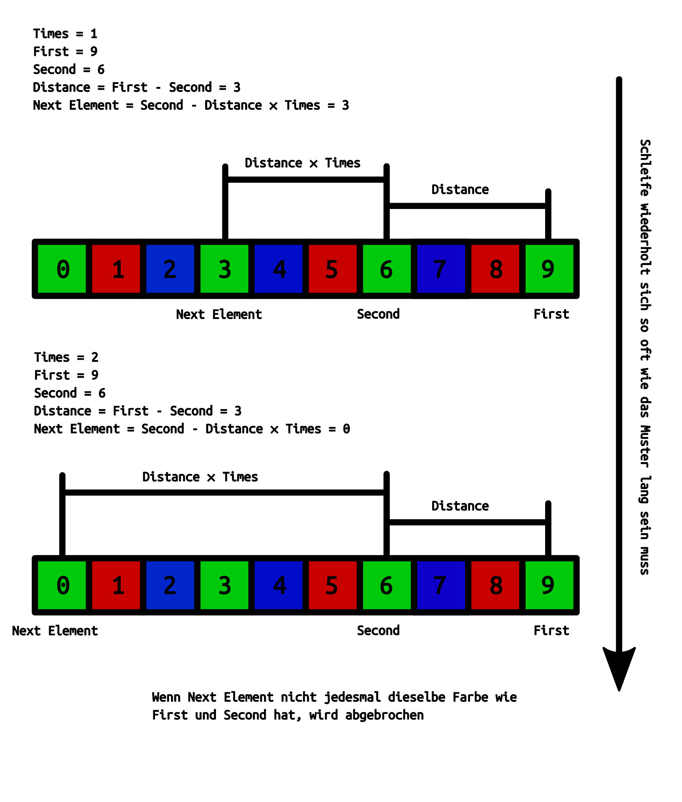
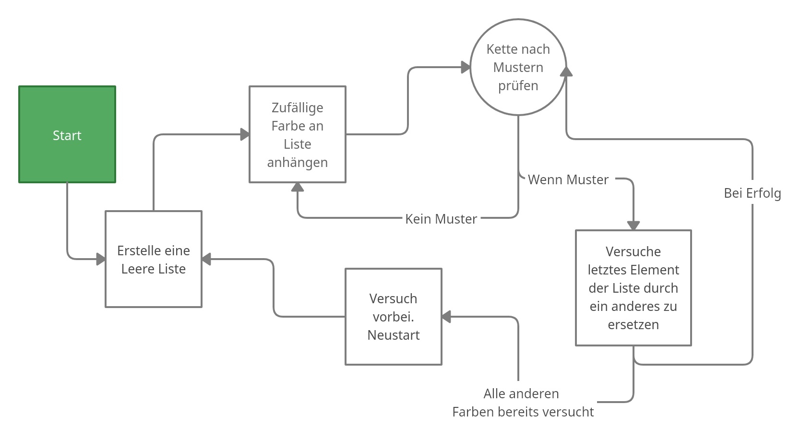

# Van der Waerden Zahlen - Ketten generator
Ein simples User Interface zum generieren und bearbeiten, von Van Der Waerden Farbketten

## Table of Contents
- [Einleitung](#Einleitung)
- [Sprache & Bibliotheken](#Sprache--Bibliotheken)
- [Setup](#Setup)
- [Benutzung](#Benutzung)
- [Quellen](#Quellen)
- [Status](#Status)

## Einleitung
Dieses Programm ist im Rahmen eines Jugendforscht Projekts entwickelt worden. Es enthält einen Algorithmus zur Generierung kürzerer Van Der Waerden Zahlen. Der Satzt von van der Waerden ist ein Mathematische Problem, bei dem es darum geht aus einer bestimmten Anzahl (𝑟) verschiedener Elemente, die meist als Farben dargestellt werden, eine Möglichst lange Kette zu erzeugen. Dabei dürfen eine bestimmte Anzahl (𝑙) an Elementen der selben Farbe nicht in regelmäßigen Abständen zueinander stehen. Dieser Fall wird als Muster bezeichnet. Was für die unterschiedlichen Parameter (𝑟 und 𝑙) die Maximal länge einer Kette ohne Muster ist, ist nicht bekannt. Mit diesem Programm soll es möglich gemacht werden, mit unterschiedlichen Werten zu experimentieren und eigene Überlegungen anzustellen. 

## Sprache & Bibliotheken
##### Programmiersprache:
- Python 3.6
##### Bibliotheken:
- PyQt5 5.15.6
- QDarkStyle 2.8.1
- pygame 2.1.2
##### Interne Bibliotheken:
- turtle
- random
- sys
- os
- re
- as

## Setup
### Linux (Ubuntu)
- ##### Wenn Python noch nicht installiert: 
  ```sh
  sudo apt install python
- ##### Wenn Pip noch nicht installiert:
  ```sh
  sudo apt install pip
- ##### Benötigte Bibliotheken installieren: 
  ```sh
  pip install -r requirements.
- ##### Programm starten:
  ```sh
  python3 Main.py
### Windows
- ##### Wenn Python3 noch nicht installiert:
    - Windows installer von der [Python download](https://www.python.org/downloads/release/python-3102/) seite herunterladen
    - Installer öffnen und Python installieren
- ##### Wenn Pip noch nicht installiert:
    - [get-pip.py](https://bootstrap.pypa.io/get-pip.py) herunterladen.
    - Command line öffnen und ins Download Verzeichnis navigieren
        ```sh
        cd <Download Verzeichnis>
    - Pip installieren
        ```sh
        python get-pip.py
- ##### Benötigte Bibliotheken installieren
    - ins Projekt Verzeichnis navigieren
        ```sh
        cd <Projekt Verzeichnis>
    - Bibliotheken installieren
        ```sh
        pip install -r requirements.txt
- ##### Programm starten
    ```sh
    python Main.py
## Benutzung
### Hauptfenster
Hier noch eine kleine übersicht, über die verschiedenen Bedienelemente des Hauptfensters:

### Grafische Darstellung
Mithilfe der grafischen Darstellung können Farbketten wesentlich leichter analysiert und eingeordnet Werden. Dabei werden Alle im unteren Textfeld gelisteten Ketten untereinander als aneinanderreihung Farbiger Quadrate dargestellt. Momentan wird hierfür ein neues Pygame fenster geöffnet. Diese Funktion soll es erleichtern sich einen Überblick über lange Listen an Ketten zu verschaffen.

### Wegdiagramme
Eine experimentelle Darstellungs Weise verschiedener Ketten, bei der Statt einzelnen Elementen ein durchgehender Weg je nach Inhalt der Ketten gezeichnet wird. Dabei steht jede verschiedene Farbe für eine andere Richtung, in die der Weg weiter verläuft. Gezeichnet wird diese Grafik bis jetzt mithilfe der Python Bibliothek Turtle. 




## Algorithmen
### Muster erkennungs Algorithmus:
Unser Erkennungsalgorithmus besteht im großen und ganzen aus einer for-Schleife, die die Positionen mehrerer Elemente der selben Farbe miteinander Vergleicht und Bei gleichen Abständen ein Muster erkennt. Diese for-Schleife wird so oft wiederholt, wie die eingestellte Musterlänge vorgibt. Hier noch eine kleine Illustration für besseres Verständnis:

### Ketten generierungs Algorithmus:
Der Generierungsalgorithmus geht bislang noch relativ simpel vor. An eine anfangs leere Kette werden nacheinander einzelne Elemente einer zufälligen Farbe angehängt. Nach jeder Anhängung wird dann vom Erkennungsalgorithmus geprüft ob ein Muster vorhanden ist. Ist dies der Fall, wird das letzte Element durch eines einer anderen Farbe ersetzt. Falls bei jeder verfügbaren Farbe ein Muster entstehen sollte, kann die Kette nicht weiter Verlängert werden und der Durchlauf ist beendet. Dieser Algorithmus ist bei weitem nicht perfekt, reicht jedoch für kurze Ketten mit geringen Startparametern vollkommen aus. Hier noch ein Flussdiagramm zur besseren Veranschaulichung des Vorgehens:

## Quellen

## Status
